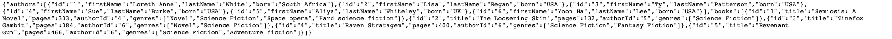

# istio-lohika-course

## Lesson #2

* Kiali UI screenshot (Application Tab)

* Kiali UI screenshot (Graph Tab)

* Jeager screenshot

* Grafana UI frontend screenshot

* Grafana UI authors screenshot

* Grafana UI books screenshot

* Response screenshot

